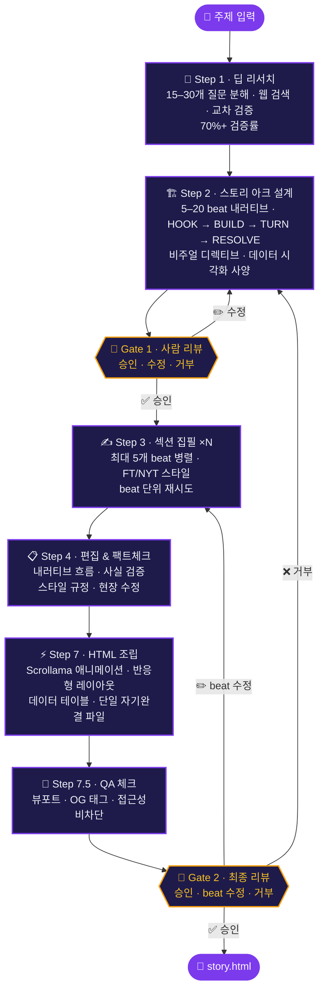

<div align="center">

# Visual Story Creator

**주제 하나만 넣으면, 출판 수준의 인터랙티브 비주얼 스토리가 자동으로 만들어집니다.**

입력: 주제 한 줄. 출력: 스크롤 애니메이션이 있는 완성된 HTML 페이지.

[**라이브 데모 (한국어)**](https://kipeum86.github.io/visual-story-creator/ko.html) &nbsp;&middot;&nbsp; [**Live Demo (English)**](https://kipeum86.github.io/visual-story-creator/en.html) &nbsp;&middot;&nbsp; [English README](README.md)

---

<br>


</div>

<br>

## 무엇을 하는 도구인가

Visual Story Creator는 **주제 하나**를 받아서 **완전한 스크롤텔링 HTML 페이지**를 생성하는 AI 파이프라인입니다. Financial Times나 The New York Times에서 볼 수 있는 수준의 인터랙티브 비주얼 스토리를 자동으로 만듭니다.

템플릿 없음. 드래그 앤 드롭 없음. 수동 레이아웃 없음. 주제만 넣으면 딥 리서치, 스토리 아크 설계, 섹션 집필, 편집 리뷰, 인터랙티브 HTML 조립까지 파이프라인이 전부 처리합니다.

> **결과물은 단일 `.html` 파일입니다.** 아무 브라우저에서 열면 됩니다. 서버도, 의존성도, 빌드 과정도 필요 없습니다.

<br>

## 파이프라인 구조



<br>

## 에이전트 구성

각자 하나의 역할만 담당하는 5개의 전문 Claude Code 서브 에이전트:

| 에이전트 | 역할 | 핵심 기능 |
|:---------|:-----|:---------|
| **Researcher** | 주제 심층 조사 | 15–30개 질문 분해, 웹 검색, 교차 검증으로 70%+ 신뢰도 확보 |
| **Arc Designer** | 내러티브 설계 | FT/Pudding 스크롤텔링 패턴을 따르는 5–20 beat 스토리 아크 설계 |
| **Section Writer** | beat별 집필 | FT/NYT 에디토리얼 문체, beat 유형별 엄격한 글자 수 제한, 최대 5개 병렬 실행 |
| **Editor** | 리뷰 및 교정 | 내러티브 흐름, 사실 정확성, 글자 수, 스타일 확인 — 직접 수정 |
| **Layout Assembler** | 최종 HTML 빌드 | beat을 Scrollama 기반 인터랙티브 스크롤텔링으로 변환, 데이터 테이블, 반응형 디자인 |

<br>

## 결과물 품질

파이프라인은 다음 기준에서 **출판 수준** 품질을 목표로 합니다:

- **글쓰기** — 짧고, 구체적이고, 능동태. 군더더기 없음. 모든 문장이 존재 이유가 있음.
- **데이터** — 모든 수치가 출처 추적 가능. 미검증 데이터는 명시적으로 표시.
- **비주얼** — 스크롤 트리거 애니메이션, 통계 카드, 비교 그리드, 타임라인, 데이터 테이블.
- **인터랙티브** — 프로그레스 바, 목차 네비게이션, 부드러운 스크롤 전환.
- **접근성** — 시맨틱 HTML, 반응형 디자인, 가독성 높은 타이포그래피.
- **이식성** — 단일 `.html` 파일. 외부 의존성 없음. 어디서든 열 수 있음.

<br>

## 사용 방법

### 사전 요구사항

- [Claude Code](https://docs.anthropic.com/en/docs/claude-code) CLI 설치 및 인증 완료

### 파이프라인 실행

```bash
cd visual-story-creator
claude
```

오케스트레이터가 `CLAUDE.md`를 읽고 주제를 물어봅니다. 이후 자동으로 실행되며, 두 개의 사람 리뷰 게이트에서만 멈춥니다.

### 파이프라인 상태 관리

모든 진행 상황은 `output/pipeline_state.json`에 기록됩니다. 실행이 중단되면 같은 디렉토리에서 Claude Code를 다시 실행하면 마지막 완료 단계부터 자동 재개됩니다.

<br>

## 설계 원칙

| 원칙 | 구현 방식 |
|:-----|:---------|
| **속도보다 품질** | 각 단계를 철저하게 실행, 지름길 없음 |
| **비차단 진행** | 이미지나 데이터 시각화가 없으면 플레이스홀더로 대체, 파이프라인을 막지 않음 |
| **우아한 복구** | 각 단계 최대 2회 재시도 후 사용자에게 에스컬레이션 |
| **사람이 루프 안에** | 두 개의 승인 게이트로 내러티브 방향에 대한 통제권 유지 |
| **사용자 작업 보존** | 게이트 거부 시 기존 산출물을 삭제하지 않음 |
| **단일 파일 출력** | 최종 결과물은 휴대 가능한 HTML 파일 하나 — 서버 불필요 |

<br>

## 기술 스택

- [Claude Code](https://docs.anthropic.com/en/docs/claude-code) — AI 에이전트 오케스트레이션
- [Scrollama](https://github.com/russellsamora/scrollama) — 스크롤 트리거 애니메이션
- [Financial Times](https://ig.ft.com/) 및 [The Pudding](https://pudding.cool/)의 비주얼 스토리텔링에서 영감

<br>

## 라이선스

[Apache License 2.0](LICENSE) 하에 배포됩니다.

---

<div align="center">

**[라이브 데모 보기](https://kipeum86.github.io/visual-story-creator/)**

Made with Claude Code.

</div>
